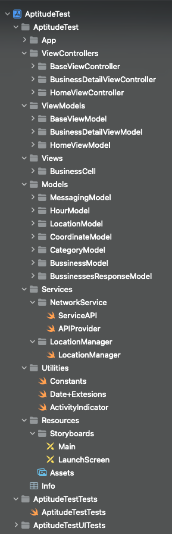

# 42Race_Assignment

## INTRODUCTION

In this project I used MVVM design pattern and the app supports ios 12 and above. At first I didn't think that I would like to use 3rd party libraries because I haven't used RxSwift in a long time, but later I still decided to use RxSwift as a challenging to review my knowledge about this library. I used this library to bind data between ViewModel and ViewController.

## Features

- [x] Get local businesses based on user location.
- [x] Search by business name.
- [x] Search by address/city/postal code.
- [x] Sorting of results by distance and ratings.
- [x] Show business detail with information.

## Project structure

- [x] **App folder:**
  - Contains Appdelegate and SceneDelegate
- [x] **ViewControllers folder:**
  - Contains all the ViewController in the project.
  - **BaseViewController** is the place where all common setups for the Controllers.
- [x] **ViewModels folder:**
  - Contains all the ViewModel.
  - **BaseViewModel** is exactly the same function with BaseViewController except it's for ViewModels.
- [x] **Views folder:**
  - Contains custom views in project.
- [x] **Models folder:**
  - Contains all the models that used in project.
- [x] **Services folder:**
  - ServiceAPI is basically help me separate the parameters for API request and the Network layer.
  - APIProvider is a Singleton that help me interact with the Server.
  - LocationManager is also a Singleton that get the user location.
- [x] **Utilities folder:**
  - Contains the API Key, support functions and extensions.
- [x] **Resources folder:**
  - Contains Storyboards, Assets and Info.plist file.
- [x] **AptitudeTestTests folder:**
  - This is the place that I implemented unit test.
